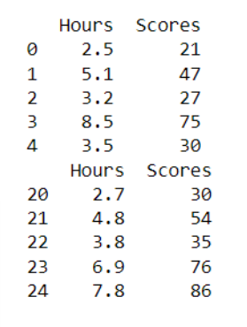
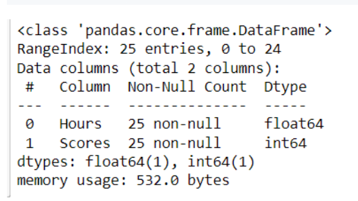
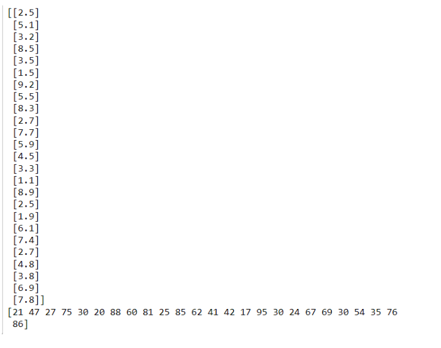
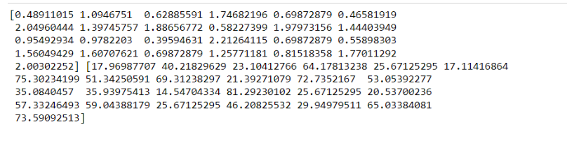
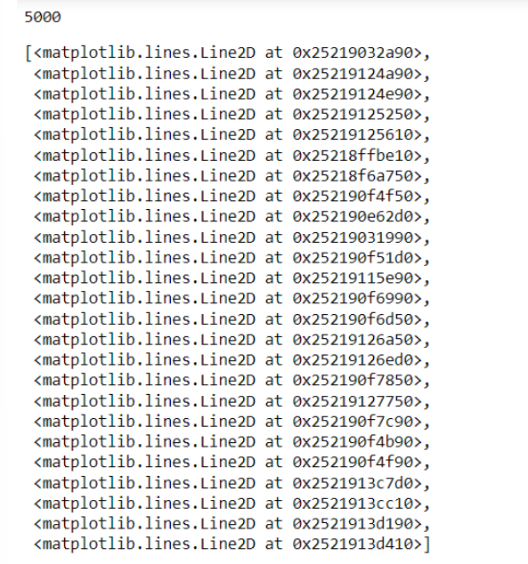
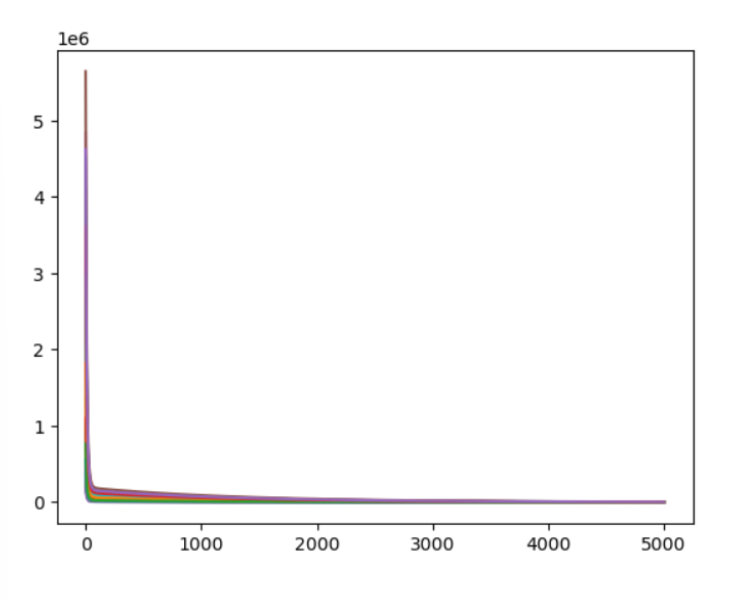

# Implementation-of-Linear-Regression-Using-Gradient-Descent

## AIM:
To write a program to predict the profit of a city using the linear regression model with gradient descent.

## Equipments Required:
1. Hardware – PCs
2. Anaconda – Python 3.7 Installation / Jupyter notebook

## Algorithm
1. Import Libraries: Load necessary libraries for data handling, metrics, and visualization.
2. Load Data: Read the dataset using pd.read_csv() and display basic information.
3. Initialize Parameters: Set initial values for slope (m), intercept (c), learning rate, and epochs.

4. Gradient Descent: Perform iterations to update m and c using gradient descent.

5. Plot Error: Visualize the error over iterations to monitor convergence of the model.


## Program and Outputs:
```
/*
Program to implement the linear regression using gradient descent.
Developed by: VISWANADHAM VENKATA SAI SRUTHI
RegisterNumber: 212223100061 
*/
```
```
import numpy as np
import pandas as pd
from sklearn.metrics import mean_absolute_error,mean_squared_error
import matplotlib.pyplot as plt
```
```
dataset=pd.read_csv('student_scores.csv')
print(dataset.head())
print(dataset.tail())
```



```
dataset.info()
```


```
#assigning hours to X & scores to Y
X = dataset.iloc[:,:-1].values
print(X)
Y = dataset.iloc[:,-1].values
print(Y)
```


```
#Building the model
m = 0
c = 0

L = 0.001  #The learning Rate
epochs = 5000  #The number of iterations to perform the task

n = float(len(X)) # Number of elements in X
error = []
#Performing Gradient Descent
for i in range(epochs):
    Y_pred = m*X + c # The current  predicted value of Y
    D_m = (-2/n) * sum(X * (Y - Y_pred))   # Derivative wrt m
    D_c = (-2/n) * sum(Y - Y_pred)   # Derivative wrt c
    m = m - L * D_m   # Update m
    c = c - L * D_c   # Update c
    
    error.append(sum(Y - Y_pred)**2)

print(m,c)
```

```
type(error)
print(len(error))
plt.plot(range(0,epochs),error)
```


## Result:
Thus the program to implement the linear regression using gradient descent is written and verified using python programming.
